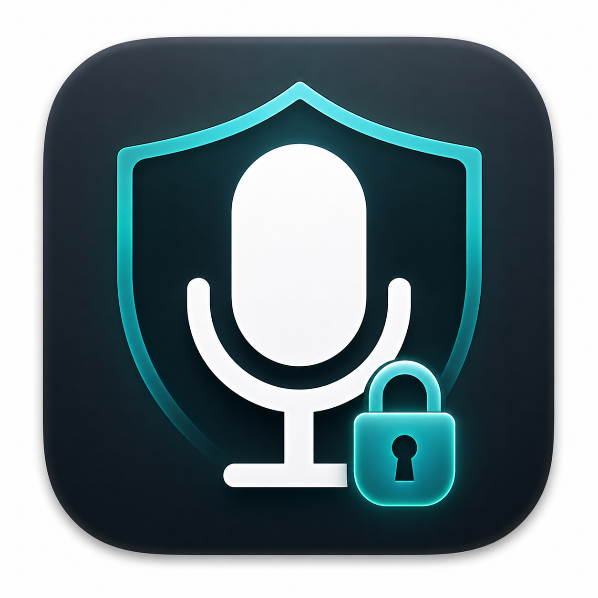
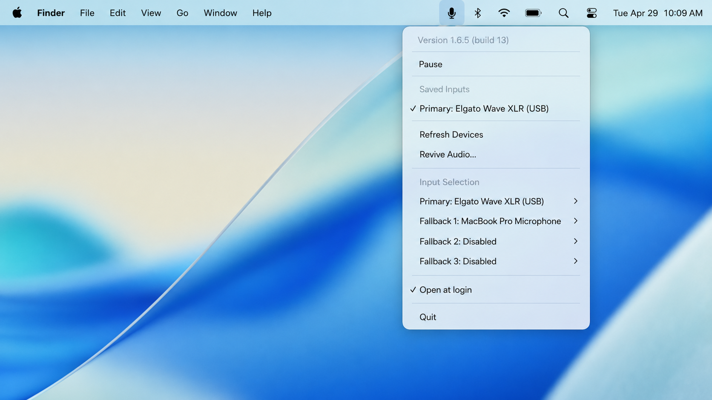

# MicLock for macOS

<p align="center">
  
</p>

<h3 align="center">Lock your Mac to the right microphone.</h3>

<p align="center">
  <strong>Mac Bluetooth headphone sound quality fix for AirPods, Sony WH-1000XM4, WH-1000XM5, WH-1000XM6, and other headsets.</strong>
</p>

<p align="center">
  <a href="https://github.com/WantbeFree/MicLock/releases/latest"></a>
  <a href="https://github.com/WantbeFree/MicLock/releases/latest"></a>
  
  
  <a href="LICENSE"></a>
</p>

MicLock is a tiny native AppKit menu bar app that keeps macOS from switching your input device to a Bluetooth headset microphone. That switch can force Bluetooth audio into low-quality two-way headset mode, making music, calls, games, and meetings sound compressed, muffled, or “telephone-like”.

<p align="center">
  
</p>

## 🚀 Download

- Latest release: [MicLock 1.6.5](https://github.com/WantbeFree/MicLock/releases/tag/v1.6.5)
- Package: Developer ID signed and Apple notarized.
- Requirements: macOS 13.0+, Apple Silicon Mac (`arm64`).
- Install: download the zip, unzip it, move `MicLock.app` to `/Applications`, then launch it.

## 🎧 Why MicLock exists

Apple documents the root behavior: when a Bluetooth headset microphone is used, macOS can switch the headset into a lower-quality mode for simultaneous input and output. Community reports show the same pattern with AirPods, Sony WH-1000XM series, and other Bluetooth headsets.

MicLock does not “repair” Bluetooth microphone quality. It prevents the bad state by keeping input on a better microphone, such as:

- MacBook built-in microphone.
- Elgato Wave XLR or other USB/XLR interface.
- Studio microphone, webcam microphone, dock microphone, or display microphone.
- Any preferred CoreAudio input device saved as Primary or Fallback.

## ✅ Problems it solves

| Problem | What MicLock does |
| --- | --- |
| AirPods sound becomes bad on Mac after opening Zoom, Teams, Discord, Telegram, FaceTime, or browser calls | Restores your preferred input so AirPods stay output-only |
| Sony WH-1000XM4, WH-1000XM5, or WH-1000XM6 switches into headset mode | Keeps macOS from making the Sony microphone the default input |
| Mac reconnects Bluetooth headphones after sleep and chooses the headset mic | Refreshes devices after wake and reapplies Primary/Fallback order |
| USB/XLR microphone disappears after sleep or dock reconnection | Offers `Refresh Devices` and `Revive Audio...` without quitting the app |
| Preferred mic is unplugged | Falls through three saved fallback microphones, then to a safe built-in/non-wireless input |
| Saved mic is disconnected | Keeps last known device name visible, marked unavailable, so setup is not lost |

## 🎙️ Common affected devices

MicLock is device-agnostic. It works with CoreAudio input devices on Apple Silicon Macs. These are common devices and families people hit this problem with:

- Apple AirPods 1, AirPods 2, AirPods 3, AirPods 4.
- Apple AirPods Pro 1, AirPods Pro 2, AirPods Pro 3.
- Apple AirPods Max.
- Sony WH-1000XM4, Sony WH-1000XM5, Sony WH-1000XM6.
- Sony WF-1000XM4, Sony WF-1000XM5.
- Bose QuietComfort, Bose QuietComfort Ultra, Beats, Jabra, Logitech, and other Bluetooth headsets.
- USB/XLR setups such as Elgato Wave XLR, Focusrite Scarlett, Shure MV7, Rode, Blue, webcam microphones, Thunderbolt docks, and studio interfaces.

## 🧠 How it works

- Watches CoreAudio default input changes.
- Debounces audio-device storms during Bluetooth reconnects.
- Builds a fresh snapshot of available input devices.
- Resolves input in this order: Primary → Fallback 1 → Fallback 2 → Fallback 3 → safe non-wireless input.
- Sets macOS default input back to the resolved device.
- Keeps saved disconnected devices visible by stable UID and last known name.
- Runs as a menu bar app with no Dock icon.

## 🧭 Menu guide

| Menu section | Purpose |
| --- | --- |
| Saved inputs | Quick list of Primary and Fallback devices, with checkmark on active input |
| Refresh Devices | Re-enumerate CoreAudio input devices |
| Revive Audio... | Restart CoreAudio when USB/dock audio disappears after sleep |
| Input Selection | Choose Primary and three fallback slots |
| Open at login | Launch MicLock automatically |

## 🧩 Versioning

MicLock uses semantic app versions plus Apple build numbers.

| Version | Build | Notes |
| --- | --- | --- |
| 1.6.5 | 13 | Developer ID signed, Apple notarized, Gatekeeper accepted |
| 1.6.4 | 12 | Developer ID signed package |
| 1.6.3 | 11 | Native Apple Silicon release with improved menu and release packaging |

Release artifacts are published on [GitHub Releases](https://github.com/WantbeFree/MicLock/releases). The current public package is notarized and should open without Gatekeeper warnings on supported Macs.

## 🛠️ Build from source

Requirements:

- macOS 13.0 or newer.
- Xcode 17 or newer.
- Apple Silicon Mac.

Build locally:

```bash
xcodebuild \
  -project MicLock.xcodeproj \
  -scheme MicLock \
  -configuration Release \
  -derivedDataPath build/ReleaseDerivedData \
  CODE_SIGNING_ALLOWED=NO \
  clean build
```

Create a notarized release package:

```bash
DEVELOPER_ID_APPLICATION="Developer ID Application: Your Name (TEAMID)" \
NOTARYTOOL_PROFILE=MicLock \
scripts/build_release.sh
```

Create an unsigned local test package:

```bash
scripts/build_release.sh --unsigned
```

## 🔒 Privacy

- No microphone audio is recorded.
- No network calls in the app.
- No analytics, telemetry, ads, or tracking.
- Settings are stored locally with `NSUserDefaults`.
- MicLock only reads CoreAudio device metadata and sets the default input device.

## 🧯 Troubleshooting

| Symptom | Fix |
| --- | --- |
| Headphones still sound bad | Open MicLock menu and confirm active input is not the headset microphone |
| USB mic missing after sleep | Use `Refresh Devices`; if still missing, use `Revive Audio...` |
| Saved fallback is unavailable | Reconnect the device or choose a new fallback slot |
| Menu bar icon not visible on macOS 26 | Check System Settings → Menu Bar and allow MicLock if macOS hides menu bar extras |
| App will not open | Download the latest notarized release from GitHub Releases |

## 📚 Background and community reports

- Apple Support: [If sound quality is reduced when using Bluetooth headphones with your Mac](https://support.apple.com/102217)
- Reddit: [AirPods quality is terrible on Mac because the sound input switches to AirPods Pro](https://www.reddit.com/r/AirpodsPro/comments/xw23b0)
- Reddit: [Bad sound quality on Sony WH-1000XM4 when using the mic](https://www.reddit.com/r/sony/comments/loa0ed/bad_sound_quality_on_sony_wh1000xm4_when_using/)
- Reddit: [WH-1000XM5 sound quality is terrible while using microphone](https://www.reddit.com/r/sony/comments/vnoh7p/wh1000xm5_sound_quality_is_terrible_while_using/)
- Macworld: [Having problems with Bluetooth audio quality on a Mac?](https://www.macworld.com/article/234088/mac-bluetooth-audio-quality-ways-to-fix-it.html)

## 🙌 Credits

MicLock is based on the original AirPods Sound Quality Fixer idea by Milan Toth and modernized for Apple Silicon, newer macOS releases, fallback microphone selection, signed/notarized distribution, and safer CoreAudio recovery workflows.

## 📄 License

MIT. See [LICENSE](LICENSE).
